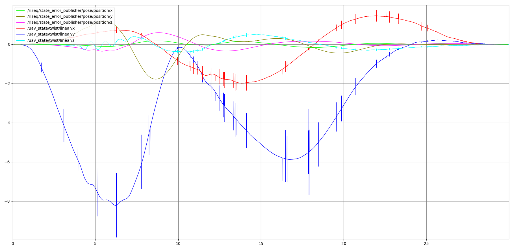

# Alpha Challenge Test 3: Technical Report. MAX 2 PAGES

##TODO

|Section|Topic|Detail|
|---|---|---|
|Introduction|||
|High Level Decisions and Reasoning| Subsections| Add 1 subsection per subsystem, indicating in each the most important decisions and reasoning.|
|Technical Description| Equations| 지호 please see my message to you in this section|
|Trajectory Generation|||
|Trajectory Tracking: Control|||
|State Estimation| Method| Eugene, are you using the derivative-free kalman filter from the differential flatness theory? using extended Kalman filter. We are not using our inputs(T, M) at prediction of state, using values from IMU.|
|State Estimation| Gate Pose Estimation| @Eugene, you now update drone's pose using gate pose and IR Marker. Is the inverse posible? Update gate pose from drone pose estimation? If not, need to delete that from Introduction   We can because we have rotation and translation vectors, but I don't know why we have to do it. Because we are not generating trajectory based on vision and predicting gates' positions. If it is necessary, please tell me.|
|Results|||
|Future Development|||
|References|||

## Introduction

Fast, autonomous flight of quadrotors requires algorithms that leverage the dynamics of the drone, fuses sensory information precisely for accurate navigation, and adapt to uncertainty. We introduce our differential-flatness (DF) based controller and state estimator, the preamble of our future RL-DFMPC controller (described in Test 1 Report). Moreover DF theory allows us to generate trajectories that make best use of drone dynamics, thus relaxing both control effort and computational requirements, and improving agility for fast maneuvers. Moreover we generate trajectories that minimize snap and improves actuator saturation and control performance. Finally, our EKF based state estimator fuses signals from the IMU, Camera and Range Finder to update drone position estimates.  

We got 19% score for Test 3 Leaderboad. Although this is a low score, during testing our GNC algorithms were able to traverse the final challenge track completely for most of the trials, and missing 2 gates as maximum.  

## High Level Decisions and Reasoning

### Trajectory Generation

We first generate trajetories for position and yaw angle using 6th order polynomials, which are the flat outputs obtained by using DF theory. Polynomials are a good decision since their derivatives are easily calculated and corridor constraints can added with relative ease. Moreover constrains that minimize trajectory snap are added and solved using quadratic programming.  Time optimization will be performed using gradient descent optimization in the time - curve length space. For this report fixed times that provide best performance were found by trial and error.  

### Controller
Just like high performance athletes learn to leverage all strenghts and weaknesses in their bodies through extensive training, our controller computes reference inputs and states that leverage drone dynamics, through differential flatness. The controller follows this references and error feedback, through PID and LQR controllers, is used to calculate correction terms allowing accurate tracking. Added to this, we use rotation matrix representation of the attitude, which affords us very agile maneuvers like inverted flight, without singularities. This controller will be dramatically improved with the inclusion of an MPC. This will be the basis for our Reinforcement Learning based controller, which will improve speed, robustness and agility of our algorithm

### State Estimator
Since drone dynamics are non-linear, an Extended Kalman Filter was used to fuse sensory input. This filter works in different modes, depending on which sensor input is available. For example, when IR markers are visible, drone's rotation and translation states are estimated with good accuracy and same error as gate's nominal position, which allows for almost perfect tracking of the reference trajectory . When the former is not true, the update equation matrices are chopped in such a way that IMU input used with lower gains. Finally, we decided to give low priority to range finder input since its use proved to not be appropriate for the irregular floor of the simulated environment.

## Technical Description
We model our drone using Newton-Euler formalism. Define an inertial frame *W* with origin *Ow* and a body-fixed frame *B* with origin *Ob* attached to the CoM of the drone. The vector *x* represents the position of *Ob* relative to *W*. The dynamic equations for movement are present in equations (1) to (4).

***지호 please insert here equations 1 to 5 from: https://jfmy.wordpress.com/2019/01/24/proof-of-differential-flatness-for-3d-quadrotor/***

## Trajectory Generation

Having gate's position is not enough for flat output trajectory generation. Computing a sensible traverse direction is necessary as well. This is done by considering the previous gate's point of view of the current gate for which the direction is computed, and computing a vector normal to the gate plane using the nominal IR marker positions. With this information, a minimum-snap 6th order polynomial trajectory is computed for the position and yaw angle. Yaw angle is important since should be such that the camera is pointing to the next gate to fly. It is then computed such that the heading vector has minimal angle to the velocity vector, which is itself tangent to position trajectory. This trajectories join all gate nominal positions into a single path that is both continuous up to the 4th derivate and tries to point as fast as possible to the next gate.

## Trajectory Tracking: Control

The input to our controller are the reference states, reference inputs and estimated states. Reference inputs are obtained from a DF-based trajectory generator and a PID controller is used to generate correction terms for them, ensuring convergence of the state error to zero. The desired thrust and angular velocities are calculated using an inverse mapping from the inputs, as in [3]. Figure 1 presents a block diagram of our controller. 

Figure 1. Block diagram of the controller.

A cascaded control architecture was followed: position control in the outer loop and orientation control in the inner loop. For position control, PID feedback was selected for its tuneability. Aggresive behaviour has higher priority than safety during racing, and PID control is a good fit that allows a good compromise between aggressiveness and stability. This controller calculates the thrust command, as well as the desired orientation and angular velocity which are passed to the inner loop. For orientation control, we selected an LQR controller for faster convergence. This is necessary as the position controller requires convergence of the desired orientation for tracking. Finally, the outer loop runs at 30Hz, while the inner loop runs much faster at 200Hz.

## State Estimation

We estimate the drons's state with IMU and camera, without any external sensors. That's why the vision process is important in the competition. From the vision, IR markers of the gates, we are using effecient PnP algorithm and homography to calculate both, drone's state from gates and gates' state from the drone. There are perturbation on the gates' nominal position, so we cannot use it as a global marker. We calculate IR marker's position from camera 2D image and the state of the drone. Then we map the position of the gate on the global coordinate. After that, we use the markers with known position on the inertial coordinate. With the information, we apply PnP algorithm with global positions of gates and projected position of the markers. That's how we calculate our drone's inertial pose. Finally, mix the informations to IMU by EKF to estimate state and predict even though there is no markers on the sight.

## Results

During our testing we were able to complete final challenge skipping 2 gates maximum. In final Test 3 Leaderboard we got 19% score. Moreover, the maximum linear speed recorded was 8m/s and maximum position error for trajectory tracking less than 2m. Figure 2 shows sample position error and linear velocities for a run on hard challenge.

## Future Development

There are 3 main future features that will allow us to reach drone-racing speeds. The first related to modelling: in particular of air dynamics including body and rotor drag, and rotor dynamics such as thrust modelling  gyroscopic effects, and flexible propeller dynamics. Second related to robustness, in concrete by adding model predictive control in the linear equivalent model obtained by differential flatness. Finally learning a neural network control policy using reinforcement learning in which our previously built controller and expert pilot input will guide policy search.

## References
[1]Faessler, M., Franchi, A., & Scaramuzza, D. (2017). Differential Flatness of Quadrotor Dynamics Subject to Rotor Drag for Accurate Tracking of High-Speed Trajectories. https://doi.org/10.1109/LRA.2017.2776353.
[2]Lee, T., Leok, M., & McClamroch, N. H. (2010). Geometric tracking control of a quadrotor UAV on SE(3). Proceedings of the IEEE Conference on Decision and Control, 5420–5425. https://doi.org/10.1109/CDC.2010.5717652
[3]Scholarsarchive, B., Mclain, T., Beard, R. W., Mclain, T. ;, Beard, R. W. ;, Leishman, R. C. ;, Mclain, T. (2011). Differential Flatness Based Control of a Rotorcraft For Aggressive Maneuvers BYU ScholarsArchive Citation Differential Flatness Based Control of a Rotorcraft For Aggressive Maneuvers, (September), 2688–2693. 
[4]Levine, S., & Koltun, V. (2013). Guided Policy Search - gps_full.pdf, 28. https://doi.org/10.1109/ICRA.2015.7138994

